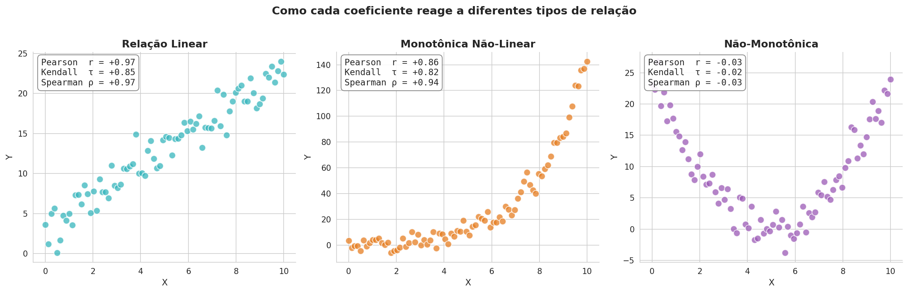
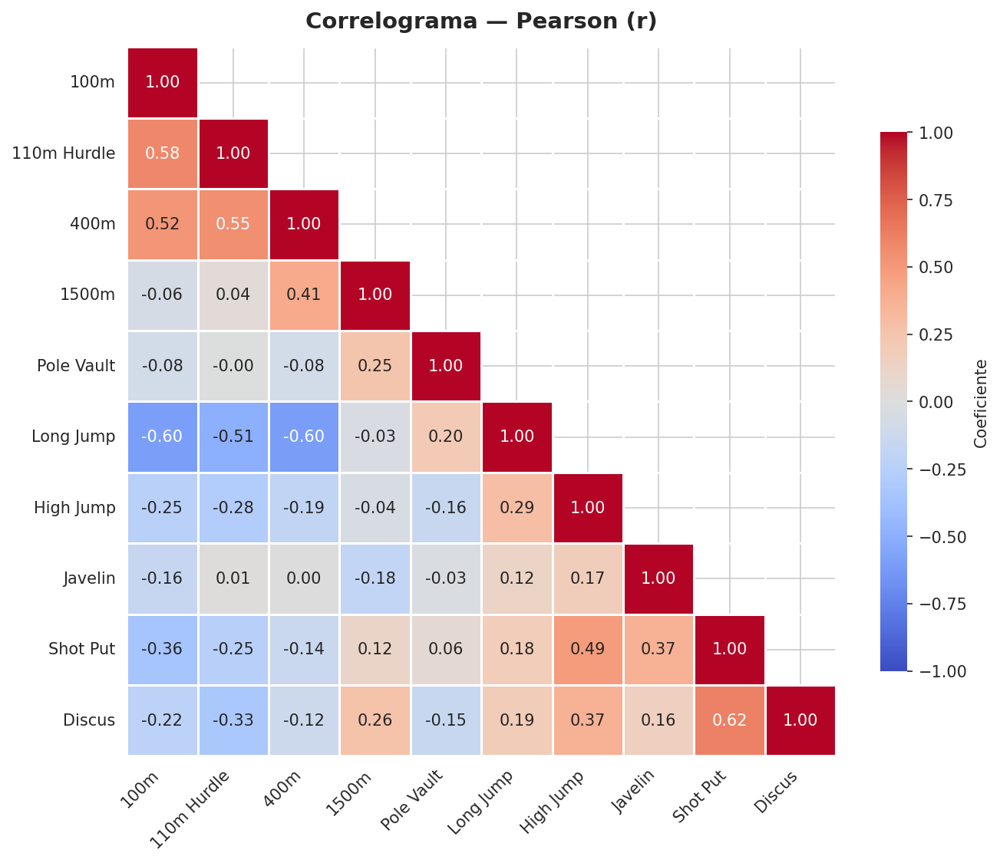
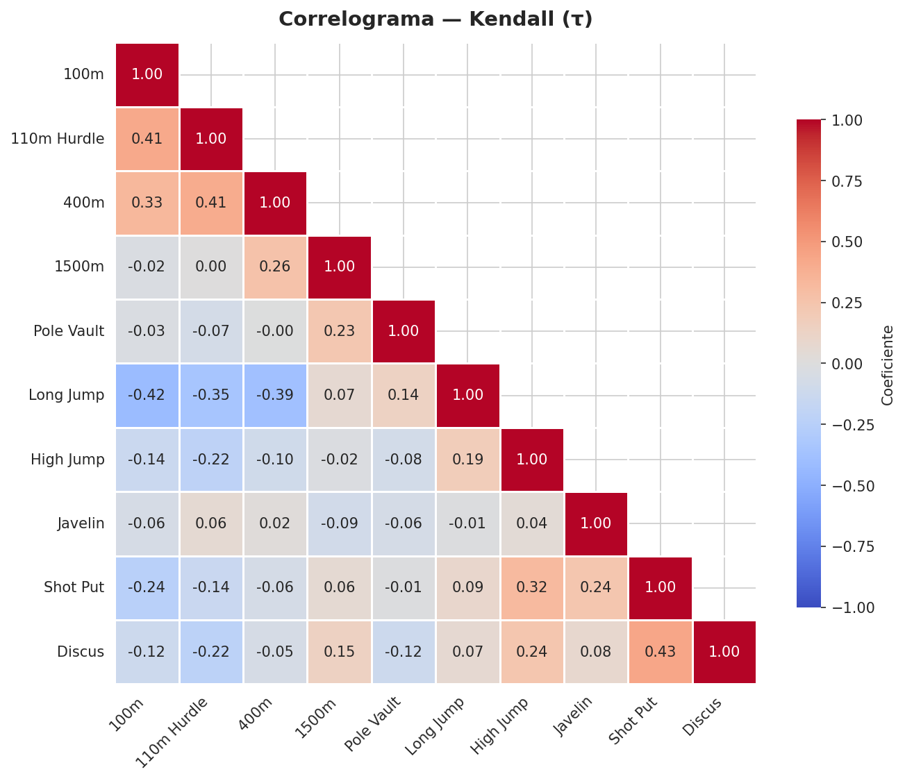
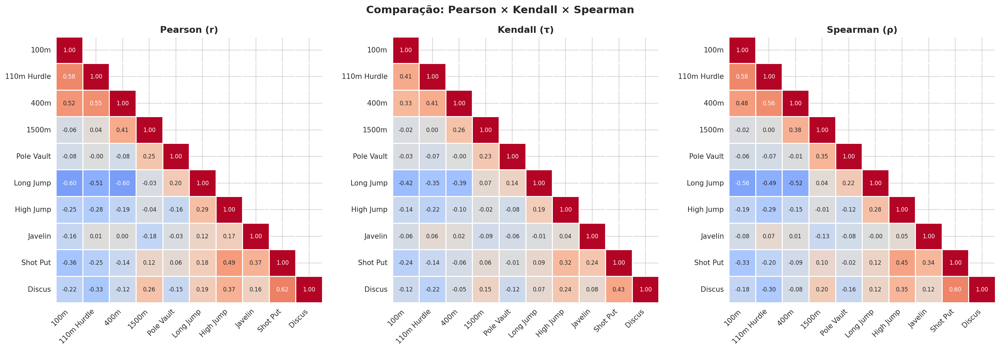
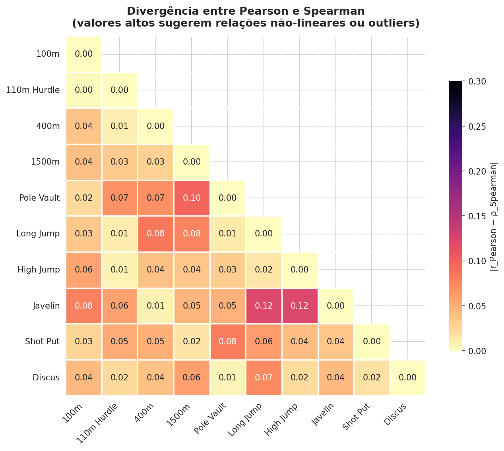
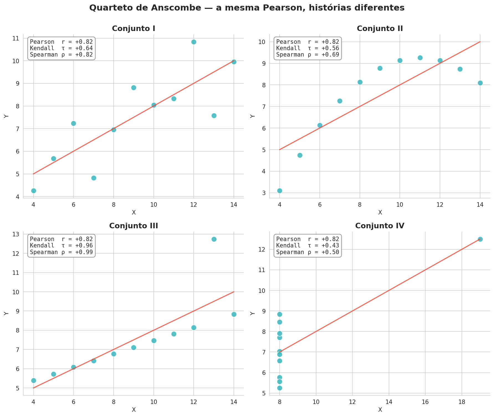

[](https://creativecommons.org/licenses/by-sa/4.0/)


<!-- Animated Header -->
<p align="center">
  
</p>

# 📈 Correlações (Pearson, Kendall, Spearman) e Matriz de Correlograma com Python

---

## 📖 Sumário

- [Introdução](#-introdução)
- [Por que estudar correlação?](#-por-que-estudar-correlação)
- [Os três coeficientes](#-os-três-coeficientes)
  - [Pearson (r)](#pearson-r)
  - [Spearman (ρ)](#spearman-ρ)
  - [Kendall (τ)](#kendall-τ)
- [Como cada coeficiente reage às relações](#-como-cada-coeficiente-reage-às-relações)
- [Qual coeficiente escolher?](#-qual-coeficiente-escolher)
- [Implementação prática com Pandas e SciPy](#-implementação-prática-com-pandas-e-scipy)
- [Matriz de Correlograma](#-matriz-de-correlograma)
- [Comparando os três correlogramas](#-comparando-os-três-correlogramas)
- [Detectando não-linearidades: |Pearson − Spearman|](#-detectando-não-linearidades-pearson--spearman)
- [O limite do Pearson: Quarteto de Anscombe](#-o-limite-do-pearson-quarteto-de-anscombe)
- [Reproduzindo as imagens deste tutorial](#-reproduzindo-as-imagens-deste-tutorial)
- [Conclusão](#-conclusão)
- [Referências](#-referências)

---

## 🎯 Introdução

Quando analisamos dois atributos numéricos ao mesmo tempo, uma das primeiras perguntas que surgem é: **eles se movem juntos?** Se o tempo dos 100 metros de um atleta melhora, seu desempenho no salto em distância também tende a melhorar? Quando um servidor público ganha mais na rubrica A, ele também ganha mais na rubrica B?

A **correlação** quantifica exatamente essa relação. Mas existem diferentes formas de medi-la, cada uma com hipóteses e sensibilidades distintas. Neste tutorial vamos estudar as três medidas mais usadas em mineração de dados — **Pearson**, **Kendall** e **Spearman** — e aprender a construir o **correlograma**, a matriz visual que resume todas as correlações de um dataset de uma vez.

---

## 🧠 Por que estudar correlação?

A correlação é uma ferramenta central em mineração de dados porque permite:

- **Explorar** o dataset logo no início do projeto (EDA — *Exploratory Data Analysis*).
- **Selecionar atributos** (*feature selection*), descartando variáveis altamente redundantes.
- **Detectar multicolinearidade** antes de treinar modelos lineares.
- **Identificar relações inesperadas** entre variáveis que sugerem hipóteses para investigação posterior.

> ⚠️ **Importante:** correlação **não implica causalidade**. Duas variáveis podem variar juntas apenas porque ambas dependem de uma terceira variável (confundidor).

---

## 📐 Os três coeficientes

Todos os três coeficientes variam no intervalo **[−1, +1]**, onde:

| Valor | Interpretação |
|-------|---------------|
| `+1`  | Associação perfeita no sentido direto |
| `0`   | Ausência de associação monotônica |
| `−1`  | Associação perfeita no sentido inverso |

A diferença está em **o que eles medem** e **como são calculados**.

### Pearson (r)

Mede a força e a direção da **relação linear** entre duas variáveis contínuas.

$$
r_{xy} = \frac{\sum_{i=1}^{n}(x_i - \bar{x})(y_i - \bar{y})}{\sqrt{\sum_{i=1}^{n}(x_i - \bar{x})^2} \cdot \sqrt{\sum_{i=1}^{n}(y_i - \bar{y})^2}}
$$

**Hipóteses:** variáveis aproximadamente normais, relação linear, sem outliers extremos.

### Spearman (ρ)

Equivale à correlação de Pearson aplicada **sobre os postos (ranks)** das observações em vez dos valores brutos. Por isso captura qualquer relação **monotônica**, mesmo que não linear.

$$
\rho = 1 - \frac{6 \sum_{i=1}^{n} d_i^2}{n(n^2 - 1)}, \quad d_i = \text{posto}(x_i) - \text{posto}(y_i)
$$

**Robusto a outliers** e não exige normalidade.

### Kendall (τ)

Baseia-se na contagem de **pares concordantes** e **pares discordantes** de observações.

$$
\tau = \frac{C - D}{\binom{n}{2}}
$$

onde `C` é o número de pares concordantes e `D` o número de pares discordantes. Também captura relações monotônicas, tende a produzir valores de **magnitude menor** que Spearman e costuma ser preferido em **amostras pequenas** ou com muitos **empates**.

---

## 🔬 Como cada coeficiente reage às relações

A figura abaixo resume o comportamento dos três coeficientes diante de três padrões clássicos: relação linear, monotônica não-linear e não-monotônica.



**O que observar:**

- **Relação linear:** Pearson, Kendall e Spearman concordam em mostrar associação forte.
- **Monotônica não-linear (exponencial):** Spearman e Kendall dão valores próximos de `+1`; Pearson subestima, pois assume linearidade.
- **Não-monotônica (parábola):** os três ficam próximos de `0` — nenhum deles detecta associações em forma de `U`, apesar da dependência clara entre `X` e `Y`.

> 💡 Quando os três coeficientes divergem muito, é um sinal forte de que a relação **não é linear** ou de que **outliers** estão influenciando o Pearson.

---

## 🧭 Qual coeficiente escolher?

| Situação | Recomendação |
|----------|--------------|
| Variáveis contínuas, aproximadamente normais, relação linear | **Pearson** |
| Variáveis ordinais ou relação monotônica não-linear | **Spearman** |
| Amostra pequena, muitos empates, necessidade de robustez | **Kendall** |
| Presença de outliers extremos | **Spearman** ou **Kendall** |
| Dúvida → calcule os três e compare | **Todos** |

---

## 💻 Implementação prática com Pandas e SciPy

Usaremos o dataset de **decatlo olímpico** (o mesmo do tutorial de PCA) para que todas as variáveis sejam numéricas e façam sentido juntas.

```python
import pandas as pd
from scipy import stats

url = 'https://raw.githubusercontent.com/nik-pi/Datasets/main/decathlon.csv'
df = pd.read_csv(url, index_col='Athlete')

# Coeficientes par a par entre duas variáveis
x = df['100m']
y = df['Long Jump']

r_p, p_p = stats.pearsonr(x, y)
r_s, p_s = stats.spearmanr(x, y)
r_k, p_k = stats.kendalltau(x, y)

print(f'Pearson:  r = {r_p:+.3f}   p-valor = {p_p:.4f}')
print(f'Spearman: ρ = {r_s:+.3f}   p-valor = {p_s:.4f}')
print(f'Kendall:  τ = {r_k:+.3f}   p-valor = {p_k:.4f}')
```

Para a **matriz completa** em todas as variáveis do DataFrame, o Pandas já oferece o método `.corr()` com o parâmetro `method`:

```python
corr_pearson  = df.corr(method='pearson')
corr_kendall  = df.corr(method='kendall')
corr_spearman = df.corr(method='spearman')
```

O resultado é um `DataFrame` simétrico onde a célula `(i, j)` contém o coeficiente entre as colunas `i` e `j`.

---

## 🗺️ Matriz de Correlograma

O **correlograma** é simplesmente a matriz de correlações apresentada como um *heatmap*, facilitando a leitura visual. Usamos `seaborn.heatmap` com um esquema divergente (`coolwarm`) centrado em zero e aplicamos uma máscara no triângulo superior para evitar redundância.

```python
import numpy as np
import matplotlib.pyplot as plt
import seaborn as sns

corr = df.corr(method='pearson')
mask = np.triu(np.ones_like(corr, dtype=bool), k=1)

fig, ax = plt.subplots(figsize=(9, 7.5))
sns.heatmap(
    corr, mask=mask, cmap='coolwarm', center=0, vmin=-1, vmax=1,
    annot=True, fmt='.2f', linewidths=0.5, square=True,
    cbar_kws={'shrink': 0.75, 'label': 'Coeficiente'}, ax=ax,
)
ax.set_title('Correlograma — Pearson (r)', fontsize=14, weight='bold')
plt.xticks(rotation=45, ha='right')
plt.tight_layout()
plt.show()
```

### Correlograma — Pearson



### Correlograma — Kendall



### Correlograma — Spearman


**Leitura rápida:**

- Células **vermelhas** → correlação positiva forte.
- Células **azuis** → correlação negativa forte.
- Células **claras (próximas de zero)** → variáveis praticamente independentes.

No contexto do decatlo, correlações negativas fortes entre `100m` e `Long Jump` fazem sentido: quanto **menor o tempo** nos 100 metros (melhor desempenho), **maior a distância** saltada.

---

## 🔄 Comparando os três correlogramas

Ver os três lado a lado evidencia em quais pares a escolha do método importa mais.



Nos pares em que as três matrizes mostram cores e magnitudes parecidas, a relação é aproximadamente linear e bem-comportada. Onde há divergência, vale olhar o *scatter plot* do par para entender o porquê.

---

## 🔎 Detectando não-linearidades: |Pearson − Spearman|

Uma estratégia útil em EDA é calcular a **diferença absoluta** entre a matriz de Pearson e a de Spearman. Valores altos sugerem:

- Relação **monotônica, porém não linear**, ou
- Presença de **outliers** puxando o Pearson para longe do Spearman.

```python
diff = (df.corr('pearson') - df.corr('spearman')).abs()
```



As células mais escuras apontam exatamente onde vale a pena investigar visualmente o par de variáveis antes de modelar.

---

## 🧪 O limite do Pearson: Quarteto de Anscombe

O clássico **Quarteto de Anscombe** (Francis Anscombe, 1973) mostra quatro conjuntos de dados com **estatísticas descritivas praticamente idênticas** — incluindo a correlação de Pearson próxima de `+0,82` — mas com gráficos completamente diferentes.



**O que isso ensina:**

1. **Nunca** confie apenas no valor numérico da correlação.
2. **Sempre** visualize o par de variáveis (*scatter plot*) antes de concluir.
3. Usar **Spearman/Kendall** em conjunto com Pearson ajuda a detectar casos patológicos como o do conjunto IV (outlier que sustenta sozinho a correlação).

---

## 🔁 Reproduzindo as imagens deste tutorial

Todas as imagens desta página foram geradas pelo script `gerar_imagens_correlacao.py`, disponível nesta mesma pasta. Para executá-lo:

```bash
# A partir da raiz do repositório, com o ambiente virtual ativo
.venv/bin/python "Tarefas de Mineração de Dados e Aplicações Práticas/gerar_imagens_correlacao.py"
```

Dependências (já cobertas pelo `requirements.txt` do repositório): `pandas`, `numpy`, `scipy`, `matplotlib`, `seaborn`.

---

## ✅ Conclusão

Neste tutorial você aprendeu:

1. **O que cada coeficiente mede** — Pearson para relações lineares, Spearman e Kendall para relações monotônicas em geral.
2. **Como calcular** os três com `scipy.stats` e com `DataFrame.corr(method=...)`.
3. **Como construir o correlograma** com `seaborn.heatmap`, incluindo máscara do triângulo superior e escala divergente.
4. **Como comparar os três correlogramas** e usar a diferença |Pearson − Spearman| para detectar não-linearidades.
5. **Por que visualizar sempre** — o Quarteto de Anscombe prova que o mesmo número pode esconder dados radicalmente diferentes.

O correlograma é, portanto, um dos mapas mais rápidos e informativos para começar qualquer projeto de mineração de dados: em um único gráfico, você enxerga onde estão as relações fortes, onde há redundância e onde vale investigar mais a fundo.

---

## 📚 Referências

- [SciPy — `scipy.stats.pearsonr`](https://docs.scipy.org/doc/scipy/reference/generated/scipy.stats.pearsonr.html)
- [SciPy — `scipy.stats.spearmanr`](https://docs.scipy.org/doc/scipy/reference/generated/scipy.stats.spearmanr.html)
- [SciPy — `scipy.stats.kendalltau`](https://docs.scipy.org/doc/scipy/reference/generated/scipy.stats.kendalltau.html)
- [Pandas — `DataFrame.corr`](https://pandas.pydata.org/docs/reference/api/pandas.DataFrame.corr.html)
- [Seaborn — `heatmap`](https://seaborn.pydata.org/generated/seaborn.heatmap.html)
- Anscombe, F. J. (1973). *Graphs in Statistical Analysis*. The American Statistician, 27(1), 17–21.
- [Dataset de Decatlo Olímpico (GitHub)](https://raw.githubusercontent.com/nik-pi/Datasets/main/decathlon.csv)

---

<p align="center">
  
</p>

---
**Resumo:** Tutorial prático sobre as correlações de Pearson, Kendall e Spearman e a construção da matriz de correlograma em Python, com exemplos reproduzíveis no dataset de decatlo olímpico.
**Data de Criação:** 2026-04-19
**Autor:** Rapport GenerAtiva
**Versão:** 1.0
**Última Atualização:** 2026-04-19
**Atualizado por:** Rapport GenerAtiva
**Histórico de Alterações:**

- 2026-04-19 - Criado por Rapport GenerAtiva - Versão 1.0
