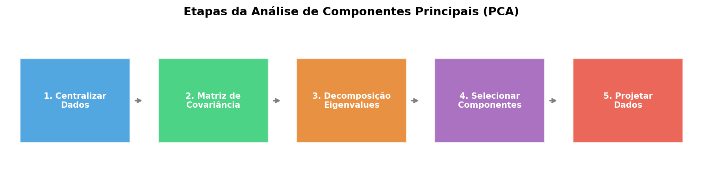
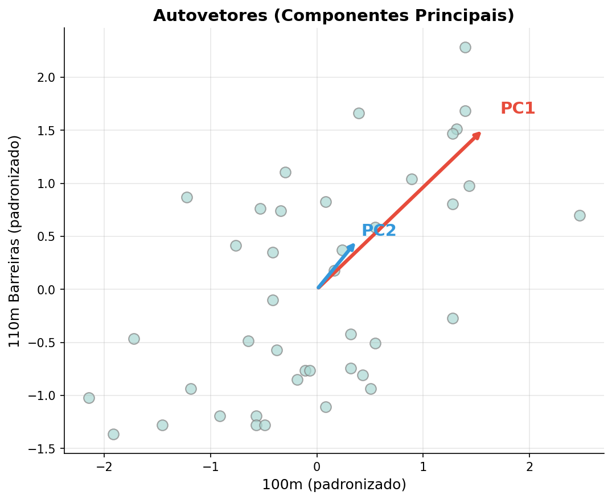
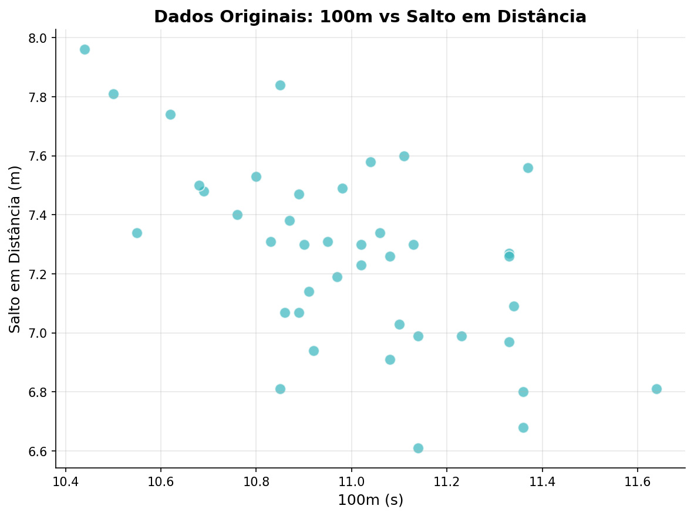
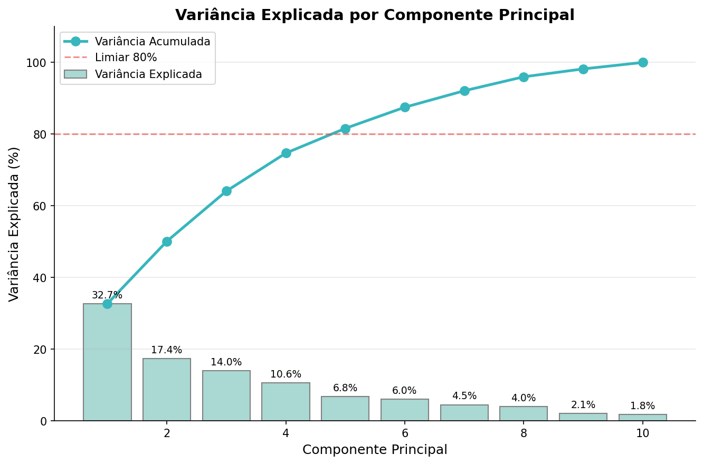
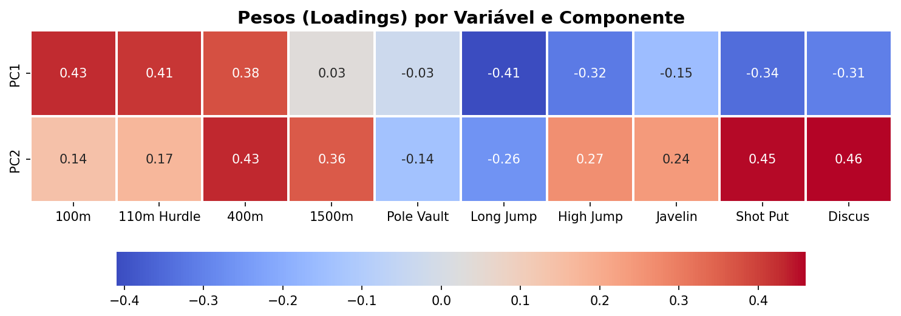
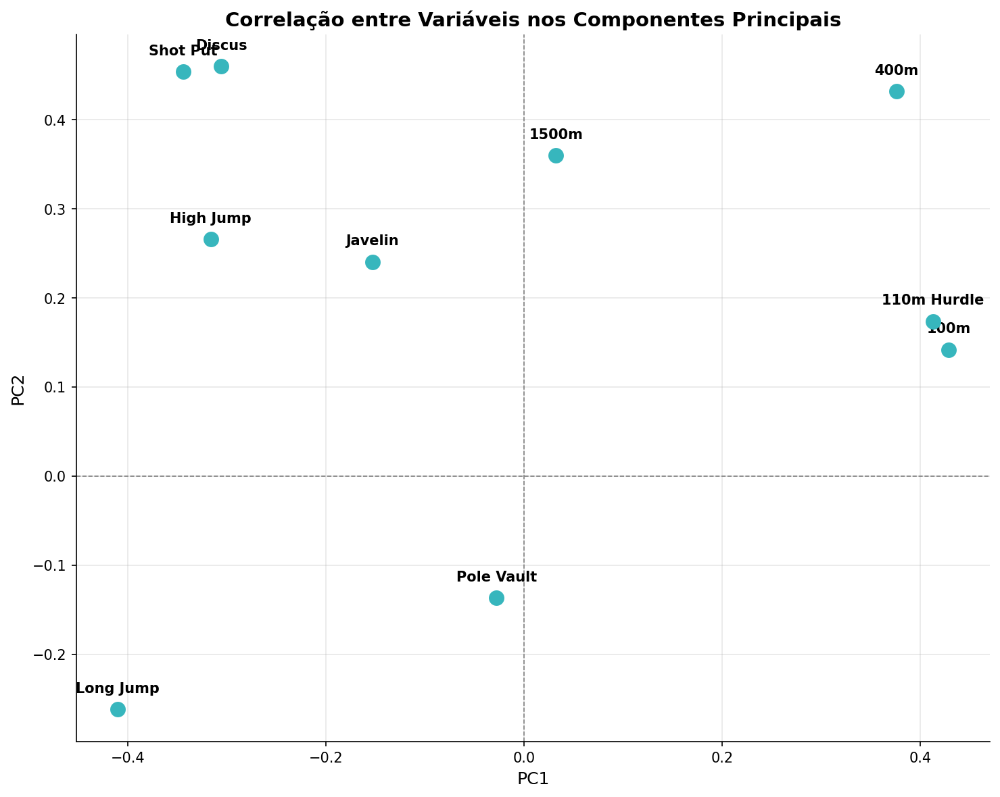
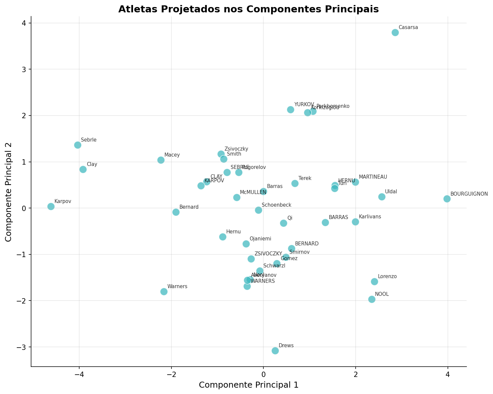

[](https://creativecommons.org/licenses/by-sa/4.0/)


<div align="center">
  

# 📊 Análise de Componentes Principais (PCA) com Python

</div>

---

## 📖 Sumário

- [Introdução](#-introdução)
- [O que é PCA?](#-o-que-é-pca)
- [Como o PCA Funciona](#-como-o-pca-funciona)
- [Implementação Prática com Scikit-Learn](#-implementação-prática-com-scikit-learn)
  - [Carregando e Explorando os Dados](#carregando-e-explorando-os-dados)
  - [Padronização dos Dados](#padronização-dos-dados)
  - [Aplicando PCA e Analisando Variância](#aplicando-pca-e-analisando-variância)
  - [Interpretando os Loadings](#interpretando-os-loadings)
  - [Visualizando os Dados Transformados](#visualizando-os-dados-transformados)
- [O que a Visualização do PCA Revela?](#-o-que-a-visualização-do-pca-revela)
- [Conclusão](#-conclusão)
- [Referências](#-referências)

---

## 🎯 Introdução

Quando trabalhamos com conjuntos de dados que possuem muitas variáveis (alta dimensionalidade), a análise se torna complexa. Visualizar dados com mais de três dimensões é praticamente impossível, e muitas variáveis podem ser redundantes ou correlacionadas entre si.

A **Análise de Componentes Principais** (do inglês *Principal Component Analysis* — PCA) é uma das técnicas mais utilizadas para lidar com esse problema. Ela reduz a dimensionalidade dos dados mantendo o máximo possível da informação original.

Neste tutorial, vamos entender o PCA de forma intuitiva e implementá-lo do zero com Python usando a biblioteca Scikit-Learn, utilizando um dataset real de competições de decatlo olímpico.

> **Nota:** Este é um conteúdo original criado para fins educacionais, inspirado no tema de PCA. Para uma referência adicional em inglês, consulte [PCA in Python — datagy.io](https://datagy.io/python-pca/).

---

## 🧠 O que é PCA?

O PCA é uma técnica de **aprendizado não supervisionado** que transforma um conjunto de variáveis possivelmente correlacionadas em um novo conjunto de variáveis **não correlacionadas**, chamadas de **componentes principais**.

Essas componentes são ordenadas de forma que a primeira captura a maior quantidade de variância dos dados, a segunda captura a segunda maior, e assim por diante.

As principais aplicações do PCA incluem:

- **Redução de dimensionalidade** — simplificar datasets complexos removendo variáveis redundantes
- **Seleção de características** — identificar quais variáveis originais mais contribuem para a variação nos dados
- **Compressão de dados** — representar dados com menos dimensões, economizando memória e processamento
- **Exploração visual** — projetar dados multidimensionais em 2D ou 3D para encontrar padrões, clusters e outliers

---

## ⚙️ Como o PCA Funciona

O processo do PCA segue cinco etapas fundamentais:



### 1. Centralização dos Dados

Subtraímos a média de cada variável para que todas fiquem centradas em zero. Isso garante que a análise de variância não seja distorcida por diferenças nas magnitudes.

### 2. Cálculo da Matriz de Covariância

A matriz de covariância quantifica como cada par de variáveis varia junto. Valores altos de covariância indicam que duas variáveis têm uma relação linear forte.

### 3. Decomposição em Autovalores e Autovetores

A partir da matriz de covariância, calculamos:

- **Autovetores** (*eigenvectors*): representam as **direções** dos componentes principais
- **Autovalores** (*eigenvalues*): representam a **magnitude** da variância capturada em cada direção



### 4. Seleção dos Componentes Principais

Ordenamos os autovetores pelo seu autovalor correspondente (do maior para o menor) e escolhemos os **n** primeiros componentes que capturam a maior parte da variância.

### 5. Projeção dos Dados

Multiplicamos os dados centrados pela matriz dos componentes selecionados. O resultado é um novo conjunto de dados com dimensionalidade reduzida.

---

## 🐍 Implementação Prática com Scikit-Learn

Vamos aplicar o PCA a um dataset real de **decatlo olímpico (Jogos de 1988)**. Cada atleta competiu em dez modalidades:

| Categoria | Modalidades |
|-----------|-------------|
| **Corrida** | 100m, 110m com barreiras, 400m, 1500m |
| **Saltos** | Salto em distância, salto em altura, salto com vara |
| **Arremessos** | Dardo, disco, arremesso de peso |

### Carregando e Explorando os Dados

```python
import pandas as pd

url = 'https://raw.githubusercontent.com/nik-pi/Datasets/main/decathlon.csv'
df = pd.read_csv(url, index_col='Athlete')
print(df.head())
```

```text
                100m  110m Hurdle   400m  1500m  Pole Vault  Long Jump  ...
Athlete
SEBRLE         11.04        14.69  49.81  291.7        5.02       7.58  ...
CLAY           10.76        14.05  49.37  301.5        4.92       7.40  ...
KARPOV         11.02        14.09  48.37  300.2        4.92       7.30  ...
BERNARD        11.02        14.99  48.93  280.1        5.32       7.23  ...
YURKOV         11.34        15.31  50.42  276.4        4.72       7.09  ...
```

Observamos que os dados estão em escalas muito diferentes: o salto em altura varia ao redor de 2 metros, enquanto os 1500m variam ao redor de 280 segundos.



### Padronização dos Dados

Antes de aplicar o PCA, é essencial **padronizar** os dados para que todas as variáveis tenham média zero e desvio padrão igual a um. Sem isso, variáveis com escalas maiores dominariam os componentes principais.

```python
from sklearn.preprocessing import StandardScaler

scaler = StandardScaler()
dados_padronizados = scaler.fit_transform(df)
```

O `StandardScaler` aplica a transformação **z-score**: para cada valor, subtrai a média e divide pelo desvio padrão da respectiva variável.

### Aplicando PCA e Analisando Variância

Primeiro, ajustamos o PCA com **todos** os componentes para analisar quanto de variância cada um explica:

```python
from sklearn.decomposition import PCA

pca = PCA()
pca.fit(dados_padronizados)

# Variância explicada por cada componente
variancia = pca.explained_variance_ratio_
```

Organizamos essa informação em um DataFrame para melhor visualização:

```python
import numpy as np

df_var = pd.DataFrame({
    'Componente': range(1, len(variancia) + 1),
    'Variância Explicada (%)': np.round(variancia * 100, 1),
    'Variância Acumulada (%)': np.round(variancia.cumsum() * 100, 1)
}).set_index('Componente')

print(df_var)
```

```text
             Variância Explicada (%)  Variância Acumulada (%)
Componente
1                              32.7                     32.7
2                              17.4                     50.1
3                              14.0                     64.1
4                              10.6                     74.7
5                               6.8                     81.6
6                               6.0                     87.5
7                               4.5                     92.1
8                               4.0                     96.0
9                               2.1                     98.2
10                              1.8                    100.0
```



**Análise dos resultados:**

- Os **2 primeiros componentes** explicam **50,1%** da variância total
- Os **4 primeiros** explicam **74,7%**
- Com **5 componentes** já ultrapassamos o limiar comum de **80%**
- Todos os 10 componentes explicam 100% (esperado, pois temos 10 variáveis originais)

Para fins de visualização, vamos trabalhar com **2 componentes**:

```python
pca2 = PCA(n_components=2)
X_transformado = pca2.fit_transform(dados_padronizados)
```

### Interpretando os Loadings

Os **loadings** (pesos ou cargas fatoriais) indicam quanto cada variável original contribui para cada componente principal. Eles são os coeficientes da combinação linear que forma cada PC.

**Como interpretar:**

| Valor do Loading | Significado |
|------------------|-------------|
| Alto (positivo ou negativo) | Variável tem **forte influência** no componente |
| Próximo de zero | Variável tem **pouca relevância** para o componente |

```python
print(pca2.components_)
```

Visualizar como heatmap facilita a interpretação:



**O que podemos observar:**

- **PC1** é fortemente influenciado por modalidades de velocidade e explosão (100m, 110m com barreiras, salto em distância)
- **PC2** é mais influenciado por modalidades de resistência e arremesso (400m, 1500m, disco, arremesso de peso)

Visualizando os loadings em um gráfico de dispersão, podemos ver quais variáveis são correlacionadas entre si:



Variáveis próximas no gráfico tendem a ser correlacionadas. Por exemplo, **100m** e **110m com barreiras** estão agrupados, o que faz sentido intuitivo — ambas exigem velocidade explosiva.

### Visualizando os Dados Transformados

Agora projetamos os atletas nos dois componentes principais:

```python
df_pca = pd.DataFrame(
    X_transformado,
    columns=['PC1', 'PC2'],
    index=df.index
)
print(df_pca.head())
```

```text
              PC1       PC2
Athlete
SEBRLE    0.7916    0.7716
CLAY      1.2350    0.5746
KARPOV    1.3582    0.4840
BERNARD  -0.6095   -0.8746
YURKOV   -0.5860    2.1310
```



---

## 🔍 O que a Visualização do PCA Revela?

A projeção dos dados nos componentes principais permite:

1. **Identificar outliers** — pontos que estão nos extremos do gráfico representam atletas com perfis muito distintos da maioria
2. **Detectar clusters** — atletas próximos no espaço PCA possuem perfis de desempenho semelhantes nas modalidades que mais variam
3. **Comparar diferenças** — atletas em extremos opostos de um componente apresentam desempenhos opostos nas variáveis que mais influenciam aquele componente

Por exemplo, se dois atletas estão em lados opostos do PC1, podemos esperar que seus rankings em corridas de velocidade e salto em distância sejam muito diferentes, já que essas são as variáveis que mais influenciam o primeiro componente.

---

## ✅ Conclusão

A Análise de Componentes Principais é uma ferramenta poderosa e versátil para:

- **Simplificar** dados de alta dimensionalidade sem perder informação essencial
- **Descobrir** estruturas ocultas nos dados através de visualização
- **Preparar** dados para outros algoritmos de machine learning, reduzindo ruído e multicolinearidade

Neste tutorial, aplicamos o PCA a dados reais de decatlo olímpico usando Scikit-Learn e demonstramos como:

1. Padronizar dados antes da análise
2. Determinar o número ideal de componentes pela variância explicada
3. Interpretar os loadings para entender o significado de cada componente
4. Visualizar e interpretar os dados transformados

O código completo para gerar as imagens deste tutorial está disponível no arquivo `gerar_imagens_pca.py` nesta mesma pasta.

---

## 📚 Referências

- [Scikit-Learn — PCA Documentation](https://scikit-learn.org/stable/modules/generated/sklearn.decomposition.PCA.html)
- [Scikit-Learn — StandardScaler Documentation](https://scikit-learn.org/stable/modules/generated/sklearn.preprocessing.StandardScaler.html)
- [PCA in Python — datagy.io (artigo de referência, em inglês)](https://datagy.io/python-pca/)
- [Dataset de Decatlo Olímpico (GitHub)](https://raw.githubusercontent.com/nik-pi/Datasets/main/decathlon.csv)

---

<div align="center">

Tutorial original sobre Análise de Componentes Principais (PCA) com Python — Repositório [ArvoreDosSaberes/Capacitacao_GemeosDigitais](https://github.com/ArvoreDosSaberes/Capacitacao_GemeosDigitais) — Organização ArvoreDosSaberes

Criado em: 18 de abril de 2025 — Licença: [CC BY-SA 4.0](https://creativecommons.org/licenses/by-sa/4.0/)


</div>
